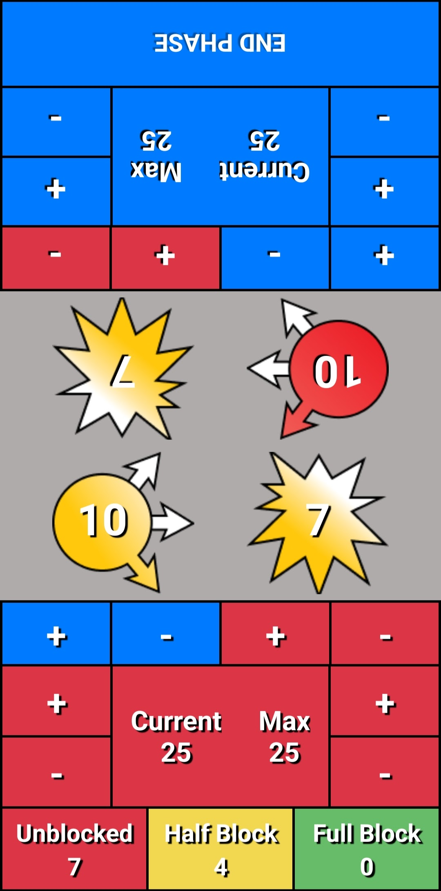
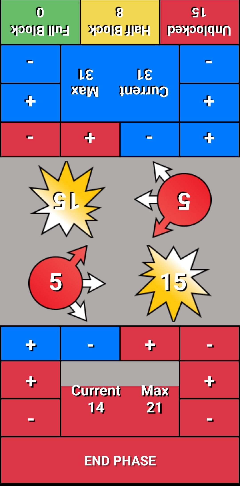
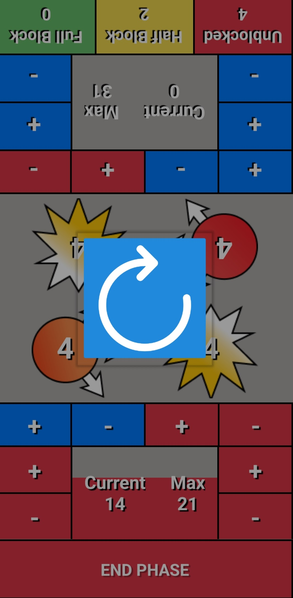

# MHA Companion App


## Table of Contents
- [Introduction](#introduction)
- [Features](#features)
- [Installation](#installation)
- [Usage](#usage)
- [Screenshots](#screenshots)
- [Donations](#donations)
- [Contact](#contact)

## Introduction

Welcome to the MHA Companion App, your go-to tool for enhancing your My Hero Academia Collectible Card Game (MHA CCG) experience! This mobile app is built using React Native and is designed to streamline matches in the MHA CCG.

As a developer, I embarked on this project with no previous experience in mobile development, specifically learning React Native for this purpose. This journey has been a great learning experience for me, and I am excited to share this app with the MHA CCG community.

The MHA Companion App will soon be available on both the App Store and Google Play Store, making it easily accessible to a wide range of users.

You can check out more of my projects and contact me on my [portfolio](https://lukemoore.au).

## Features

- **Match Management:** Easily manage matches for the MHA CCG, helping you keep track of current and maximum hp, damage, zone, and speed of incoming attacks, incoming damage from unblocked and half blocked attacks.
- **User-Friendly Interface:** The app features an intuitive and user-friendly design. Split into 2 screens, making it easy for both players to quickly analyze the match information without having to read anything upside-down. This interface makes it easy for players of all levels to use!
- **Cross-Platform:** Soon to be available on both the App Store and Google Play Store, accessible to iOS and Android users.

## Installation

To get started with the MHA Companion App, follow these steps:

1. Clone the repository to your local machine:

   ```bash
   git clone https://github.com/papa-fish/mha-companion-app
   ```

2. Navigate to the project directory:

   ```bash
   cd mha-companion-app
   ```

3. Install the required dependencies:

   ```bash
   npm install
   ```

4. Start the development server:

   ```bash
   npx expo start
   ```

5. Follow the instructions in the console to launch the app on your preferred platform (iOS or Android emulator/device).

## Usage

Once you have the app up and running, follow these steps to make the most of its features:

1. Launch the MHA Companion App on your mobile device.

2. Use the app to manage matches for the MHA CCG.

3. Enjoy a seamless and user-friendly interface designed to simplify gameplay management.

## Screenshots





## Donations

If you find the MHA Companion App helpful and would like to support its development, you can make a donation to help cover ongoing maintenance, and further improvements. Your generosity is greatly appreciated!

Donate via [PayPal](https://paypal.me/lukemooreau)

## Contact

If you have any questions, suggestions, or just want to say hi, you can reach me through my [portfolio](https://lukemoore.au) or by email at `admin@lukemoore.au`.

Thank you for using the MHA Companion App! We hope it enhances your MHA CCG experience.